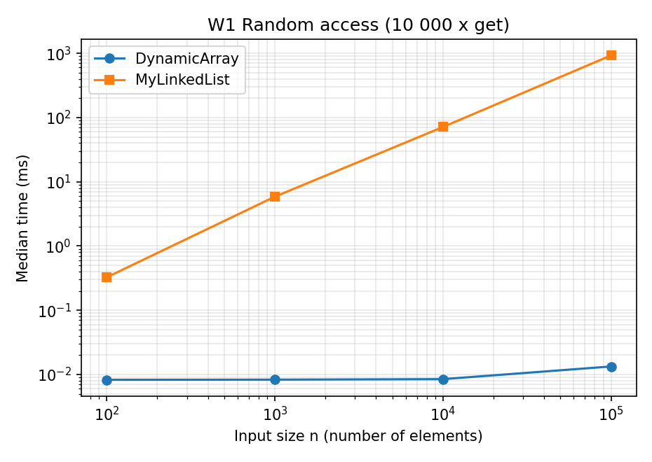
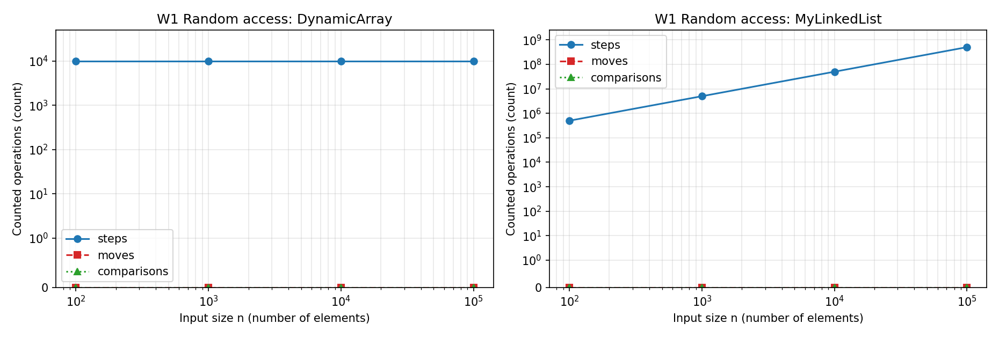
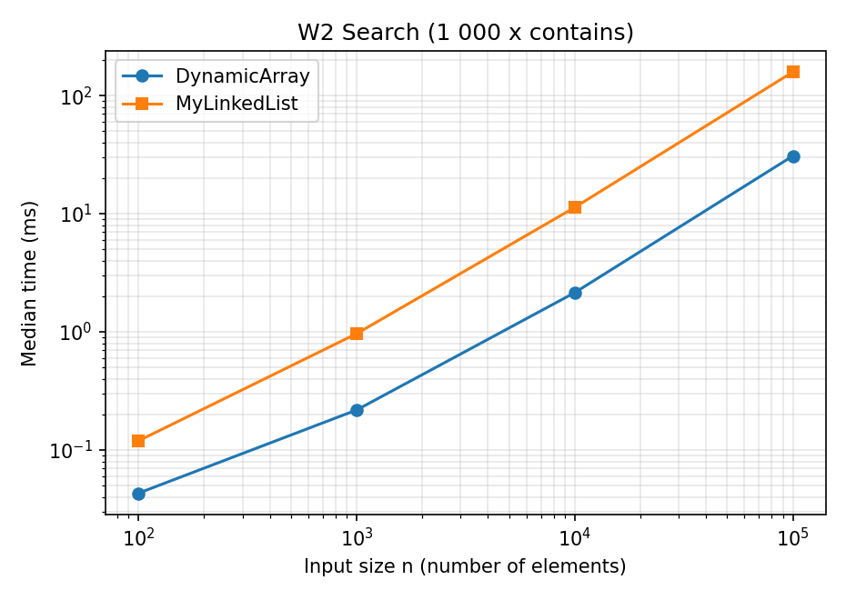
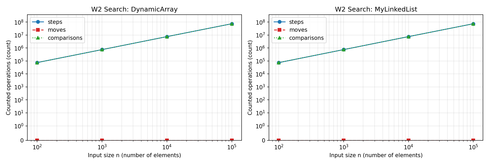
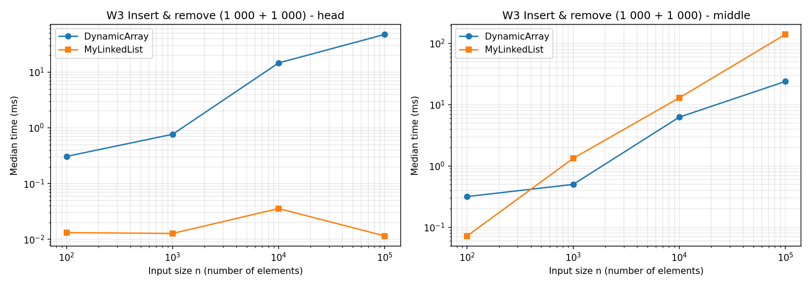
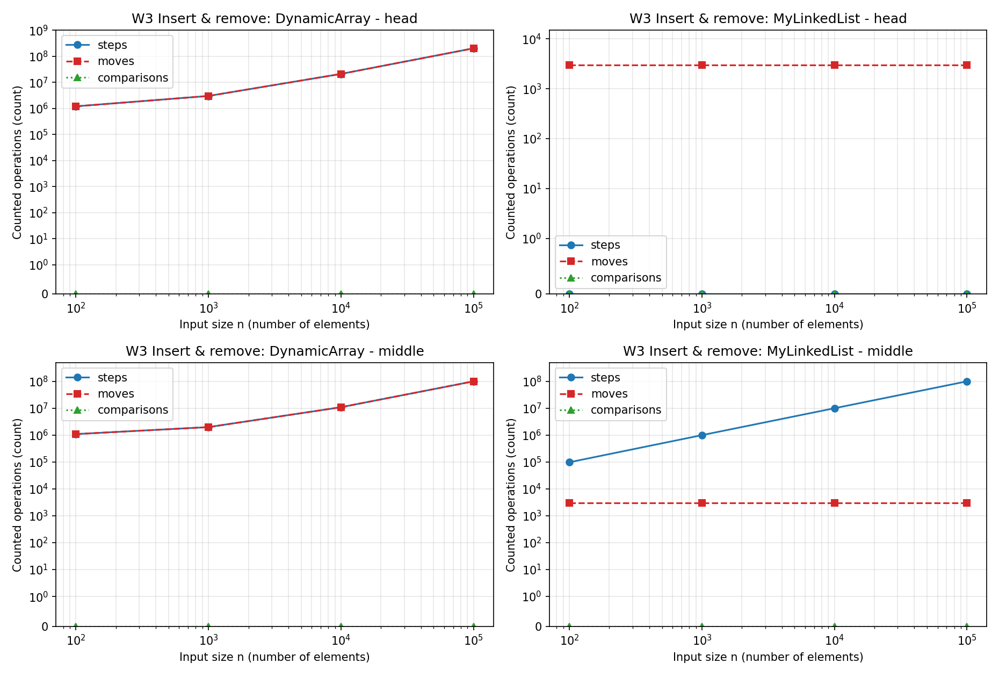
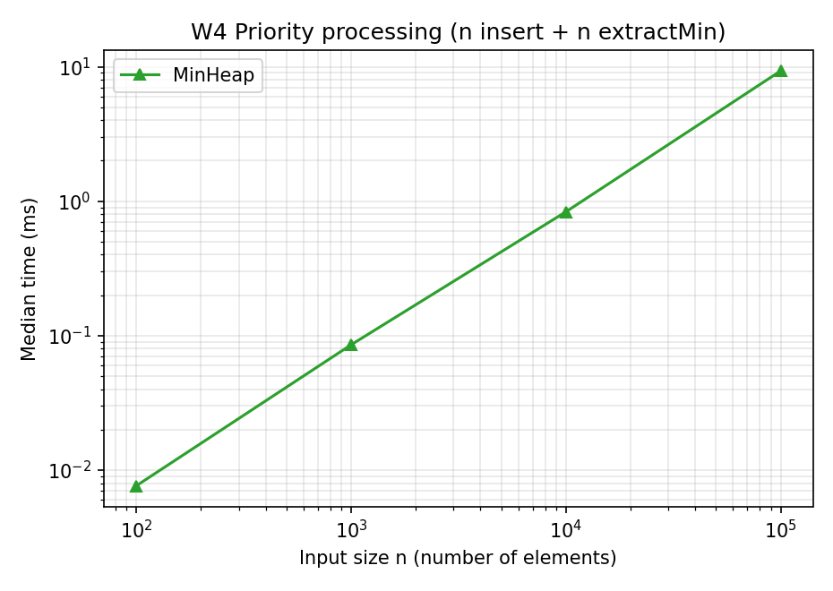
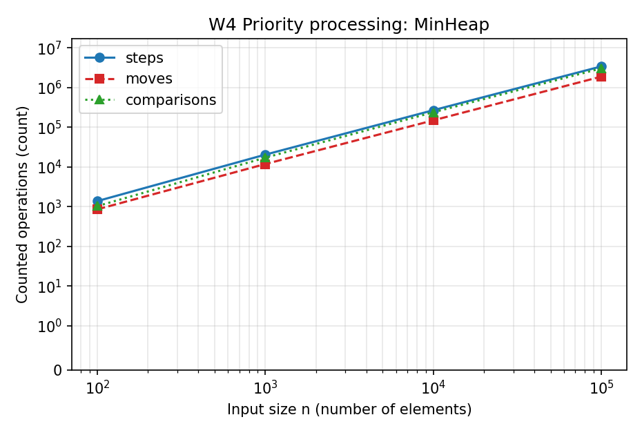
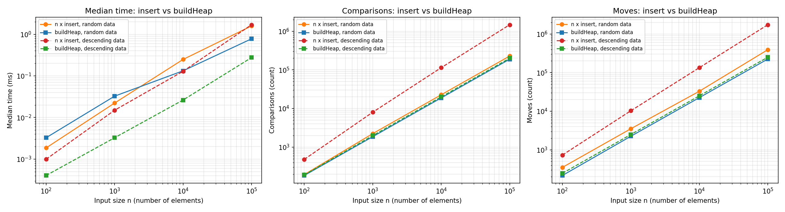
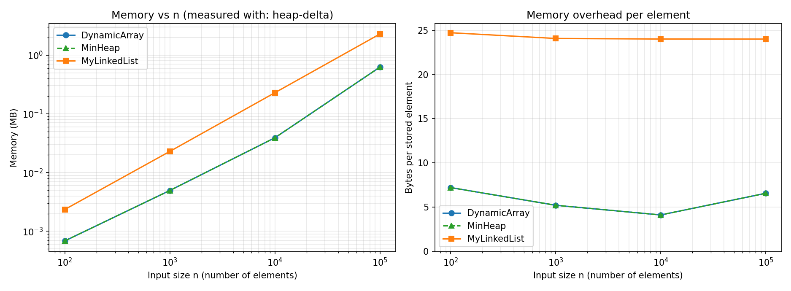

# DAA Assignment 2 - In-Memory Workload Engine: Report

**Structures:** `DynamicArray` (int[], 2x growth), `MyLinkedList` (singly linked, head + tail pointer), `MinHeap` (int[] binary min-heap).
**Setup of the measurements:** OpenJDK 21, one CPU core, `new Random(42)`, 3 discarded warm-up runs + median of 5 measured runs per case,
exact counters taken from inside the methods (see README). All numbers below come from `results/results.csv`, `results/buildheap.csv`, `results/memory.csv`.

Notation: *n* = current size, *s* = size, *i* = index. A Θ bound is used when best and worst bound coincide for that case.

## 1. Complexity table

| Structure | Operation | Best | Average | Worst | Aux. space | Justification |
|---|---|---|---|---|---|---|
| DynamicArray | `get(i)` | Θ(1) | Θ(1) | Θ(1) | Θ(1) | One index computation and one cell read, independent of *n*. |
| DynamicArray | `add(x)` | Θ(1) | Θ(1) amortized | Θ(n) | Θ(1); Θ(n) while growing | Only a store, except when the array is full: then all *n* elements are copied. Doubling means the copies cost 1 + 2 + 4 + ... < 2n over n appends. |
| DynamicArray | `add(i, x)` | Θ(1) (i = s) | Θ(n) | Θ(n) (i = 0) | Θ(1); Θ(n) while growing | Shifts the s - i elements right of i; the average over uniform i is s / 2. |
| DynamicArray | `remove(i)` | Θ(1) (i = s - 1) | Θ(n) | Θ(n) (i = 0) | Θ(1) | Shifts the s - 1 - i elements right of i; average s / 2. |
| DynamicArray | `contains(x)` | Θ(1) (first cell) | Θ(n) | Θ(n) | Θ(1) | Linear scan: stops at the match, or reads all s cells when x is absent. |
| MyLinkedList | `get(i)` | Θ(1) (i = 0) | Θ(n) | Θ(n) (i = s - 1) | Θ(1) | Must follow i `next` links from the head; average over uniform i is s / 2. |
| MyLinkedList | `add(x)` | Θ(1) | Θ(1) | Θ(1) | Θ(1) | The tail pointer avoids the walk: two link updates. |
| MyLinkedList | `add(i, x)` | Θ(1) (i = 0 or s) | Θ(n) | Θ(n) (i = s - 1) | Θ(1) | Walk to the predecessor (i - 1 hops), then two link updates. |
| MyLinkedList | `remove(i)` | Θ(1) (i = 0) | Θ(n) | Θ(n) (i = s - 1) | Θ(1) | Walk to the predecessor (i - 1 hops), then one link update (singly linked: no back pointer). |
| MyLinkedList | `contains(x)` | Θ(1) (first node) | Θ(n) | Θ(n) | Θ(1) | Same linear scan as the array, but every step is a pointer dereference. |
| MinHeap | `peekMin()` | Θ(1) | Θ(1) | Θ(1) | Θ(1) | Reads `data[0]`. |
| MinHeap | `insert(x)` | Θ(1) (x >= parent) | Θ(1) on random input (measured 2.3 comparisons per insert) | Θ(log n) (new minimum) | Θ(1); Θ(n) while growing | Bubble-up climbs at most the height ⌊log2 n⌋; most random keys stop after a level or two. |
| MinHeap | `extractMin()` | Θ(1) (all keys equal) | Θ(log n) | Θ(log n) | Θ(1) | The last leaf is large, so bubble-down usually sinks it almost to the bottom (height ⌊log2 n⌋). |
| MinHeap | `buildHeap(a)` (bonus) | Θ(n) | Θ(n) | Θ(n) | Θ(n) copy | Σ over heights h of (n / 2^(h+1)) · h = O(n); every inner node is visited at least once, so Ω(n) too. |

Memory of the structures themselves: Θ(n) for all three. `DynamicArray` and `MinHeap` keep up to 2n cells because of the 2x growth; `MyLinkedList` needs one 24-byte node per element (section 4).

## 2. Loop invariant proofs

### 2.1 `DynamicArray.remove(index)` - the shifting loop

```java
int removed = data[index];
for (int i = index; i < size - 1; i++) {
    data[i] = data[i + 1];
}
size--;
```

Let *s* be the size before the call, `a0` the content of the array before the call and 0 <= index < s.

**Invariant I(i):** before the iteration with loop variable *i* (index <= i <= s - 1)
1. `data[k] == a0[k]` for 0 <= k < index (prefix untouched),
2. `data[k] == a0[k+1]` for index <= k < i (already shifted part),
3. `data[k] == a0[k]` for i <= k < s (not yet overwritten).

**Initialization.** For i = index: (1) nothing before `index` was written; (2) the range index <= k < index is empty; (3) nothing was written at all, so `data[k] == a0[k]` for all k >= index.

**Maintenance.** Assume I(i) and i < s - 1, so the body runs: `data[i] = data[i+1]`. Because i + 1 < s, part (3) gives `data[i+1] == a0[i+1]`, therefore `data[i] == a0[i+1]` after the assignment and part (2) now covers k = i. Cell i + 1 and all later cells are untouched, so part (3) holds for the range i + 1 <= k < s, and part (1) is unchanged because i >= index. This is I(i + 1).

**Termination.** *i* grows by one per iteration and is bounded by s - 1, so the loop stops with i = s - 1 (immediately if index = s - 1). I(s - 1) says: `data[k] == a0[k]` for k < index and `data[k] == a0[k+1]` for index <= k < s - 1.

**Conclusion.** The first s - 1 cells are exactly `a0` with the element `a0[index]` deleted and the order of all other elements preserved. `size--` makes only these s - 1 cells visible (the stale last cell is ignored), and the method returns the value saved in `removed` before the loop, so `remove` is correct.

### 2.2 `MinHeap.siftDown(root, x)` - the bubble-down loop (used by `extractMin` and `buildHeap`)

```java
int i = root;
while (true) {
    int child = 2 * i + 1;
    if (child >= size) break;
    if (child + 1 < size && data[child + 1] < data[child]) child++;   // smaller child
    if (data[child] >= x) break;
    data[i] = data[child];
    i = child;
}
data[i] = x;
```

**Precondition.** The cell `root` is a free "hole" (its old value is saved in x) and both child subtrees of `root` are valid min-heaps. Let T be the subtree of `root`, *h* the loop variable `i`.

**Invariant J(h):** before every iteration
1. h lies in T, and every parent-child pair (p, c) of T with p != h and c != h satisfies `data[p] <= data[c]`;
2. if h != root, then `data[parent(h)] <= x` and `data[parent(h)] <= data[c]` for every child c of h.

**Initialization.** h = root. All pairs that do not involve `root` lie inside the two child subtrees, which are heaps by the precondition, so (1) holds; (2) is vacuous because h = root.

**Maintenance.** Assume J(h) and that the body does not `break`. Then h has a smaller child c with value v = `data[c]` and v < x. The body copies v into h and sets h' = c.
* Pair (h, c): involves the new hole h', so it is excluded from (1).
* Pair (h, sibling of c): `data[h] = v <= data[sibling]` because c is the smaller child.
* Pair (parent(h), h), if h != root: `data[parent(h)] <= data[c] = v` by (2) of J(h).
* Pairs (c, children of c) did not involve the old hole, so they were valid and `v <= data[child of c]`; this is part (2) for h', together with `data[parent(h')] = v < x`.
* All other pairs are unchanged. Hence J(h') holds.

**Termination.** Each iteration moves h one level down, so after at most ⌊log2 size⌋ iterations the loop ends, either because h has no child or because `data[smaller child] >= x`.

**Conclusion.** After the loop x is stored at h. Pairs not involving h are fine by (1). The pair (parent(h), h) is fine because `data[parent(h)] <= x` by (2). If h has no child nothing else is required; otherwise the smaller child, and therefore both children, are `>= x`. So T is a min-heap again. For `extractMin`, `root = 0` and T is the whole heap, and the removed root was the minimum by the heap property, so the operation is correct. For `buildHeap`, the nodes are processed from the last inner node to the root, so the precondition (both child subtrees are heaps) holds for each call.

## 3. Results

Each chart pair shows time against n (both structures on the same chart) and the counted steps / moves / comparisons against n
(log axes; the operation charts use a symmetric-log y axis so that zero counters stay visible).

### W1 - Random access (10 000 `get`)



### W2 - Search (1 000 `contains`, half present)



### W3 - Insert & remove (1 000 + 1 000 at head / middle)



### W4 - Priority processing (n `insert` + n `extractMin`, output checked to be sorted)



Key numbers at n = 100 000 (median time, counted operations):

| Case | DynamicArray | MyLinkedList |
|---|---|---|
| W1 get | 0.013 ms, 10 000 steps | 925.9 ms, 504 930 938 steps |
| W2 contains | 30.8 ms, 73 835 543 steps and comparisons | 158.4 ms, 73 834 543 steps, 73 835 543 comparisons |
| W3 head | 47.6 ms, 201 000 000 moves | 0.0115 ms, 3 000 moves, 0 steps |
| W3 middle | 24.0 ms, 101 000 000 moves | 140.5 ms, 99 998 000 steps, 3 000 moves |

W4 (`MinHeap`, n = 100 000): 9.3 ms, 3 422 954 steps, 1 892 009 moves, 3 059 125 comparisons (about 1.84 · n · log2 n comparisons).

## 4. Bonus tasks

### Task B - O(n) `buildHeap`


At n = 100 000 on random data `buildHeap` needs 188 424 comparisons against 227 662 for n separate `insert` calls and is 2.0x faster (0.78 ms vs 1.59 ms).
On descending data, the worst case for `insert` (every new key climbs to the root), it needs 199 978 comparisons against 1 468 946 (7.3x fewer) and is 6.2x faster (0.28 ms vs 1.70 ms).
The difference comes from where the work happens: Floyd's method sifts down, and half of the nodes are leaves (0 levels), a quarter has height 1, an eighth height 2 and so on, so the total is Σ n / 2^(h+1) · h = O(n),
about 2 comparisons per element. Repeated insertion pays up to the full height log n for each of the n keys, which is Θ(n log n) in the worst case.
On random data inserts are cheap on average (about 2.3 comparisons each), so the gap there is only a constant factor.

### Task A - memory footprint


| n | DynamicArray / MinHeap | MyLinkedList | list / array |
|---|---|---|---|
| 1 000 | 5 200 B (5.2 B per element) | 24 072 B (24.1 B per element) | 4.6x |
| 10 000 | 41 040 B (4.1 B per element) | 240 072 B (24.0 B per element) | 5.9x |
| 100 000 | 655 440 B = 0.63 MB (6.6 B per element) | 2 400 072 B = 2.29 MB (24.0 B per element) | 3.7x |

An `int[]` costs a 16-byte header plus 4 bytes per cell, so the cost per element is 4 B plus the unused part of the doubled capacity (between 4 and about 8 B per element, which is why the line is not flat).
A list node on a 64-bit HotSpot JVM with compressed references holds a 12-byte object header, the 4-byte `value` and a 4-byte `next` reference: 20 bytes, rounded up to the 8-byte object alignment, i.e. **24 bytes for 4 bytes of payload** (6x overhead before counting the garbage collector's own bookkeeping).
`DynamicArray` and `MinHeap` have identical layouts, therefore identical sizes. The `method` column of `memory.csv` states how the numbers were measured: `jol` (Java Object Layout, used when the jar can be loaded) or `heap-delta`
(live heap before and after building the structure, the fallback). The committed file was produced with `heap-delta`; its values match the layout calculation above byte for byte (for example 100 nodes x 24 B + list object = 2 472 B), and `mvn compile exec:java` replaces it with JOL numbers on a machine where JOL works.

## 5. Discussion

1. `DynamicArray.get(i)` costs one index computation and one read, so 10 000 random reads take about 0.01 ms for every n from 100 to 100 000, while the list needs 0.33 ms at n = 100 and 926 ms at n = 100 000, about 70 000 times more, because it follows about n / 2 links per call (504 930 938 counted steps against 10 000).
2. The array is also faster when both structures do the same amount of work: in W2 both perform 73.8 million comparisons and almost the same number of steps, yet the array needs 30.8 ms and the list 158.4 ms (5.1x).
3. The reason is CPU cache locality: the array cells lie next to each other, so one 64-byte cache line delivers 16 ints, the hardware prefetcher sees the sequential pattern, and the loop can run without waiting for memory.
4. A list node is a separate object of 24 bytes (header, value, reference, padding), so only about 2.7 nodes fit into a cache line and the scan touches roughly six times more cache lines than the array scan.
5. Even more important is pointer chasing: the address of the next node is known only after the current node has been loaded, so the loads form a dependency chain that the CPU cannot overlap or prefetch, whereas the array loop addresses are computed independently.
6. The same effect explains W3 middle at n = 100 000: the array shifts about 101 million elements in 24 ms (sequential reads and writes that the JIT can turn into fast block moves), while the list performs about 100 million hops plus only 3 000 link updates and needs 140 ms, 5.9x longer, although the counters look almost equal.
7. Objects add to this cost: every node has a header and lives separately on the heap, which means 24 B per element instead of 4 B (3.7x to 5.9x more memory in the bonus measurement), more allocation work, and more objects for the garbage collector to trace and reclaim; in this benchmark the nodes were allocated one after another, so they are even laid out favourably, and a list that has been modified in a random order would be scattered over memory and slower still.
8. MyLinkedList is the better choice when insertions and removals happen at the head (or at a position that is already known): in W3 head at n = 100 000 it needs 3 000 link updates and 0.0115 ms, while the array moves 201 million elements in 47.6 ms (about 4 000 times slower).
9. It is also the choice when every single operation must have a worst-case O(1) cost, because an array append occasionally copies all elements, and when the program only walks through the list from one end (queue, stack, LRU list) and never needs `get(i)`.
10. For `get(i)`, `contains` and any insertion or removal in the middle the array stays faster in practice, even though the Big-O is the same or worse, so a list only pays off when the access pattern really avoids walking.
11. MinHeap is the right structure when only the smallest element is needed repeatedly: `peekMin` is O(1), `insert` is O(log n) in the worst case and about 2.3 comparisons on random data, and `extractMin` is O(log n); W4 sorted 100 000 values (insert and extract) in 9.3 ms with about 1.84 · n · log2 n comparisons.
12. The alternatives are worse for this workload: a sorted array pays O(n) per insertion and an unsorted array or list pays O(n) per minimum search, which would be O(n^2) for n extractions, and the heap is stored in one `int[]`, so it also profits from the cache locality described above.
13. When all values are known in advance, Floyd's `buildHeap` is preferable to n inserts: it uses about 2n comparisons in every case (7.3x fewer than repeated insert on descending data, 1.2x fewer on random data) and was 2.0x to 6.2x faster at n = 100 000.
14. In short, equal Big-O does not mean equal speed: constant factors from memory layout (contiguous `int[]` against 24-byte nodes linked by pointers) decided W1, W2 and W3 middle, while the asymptotic difference (O(1) against O(n)) decided W3 head.
